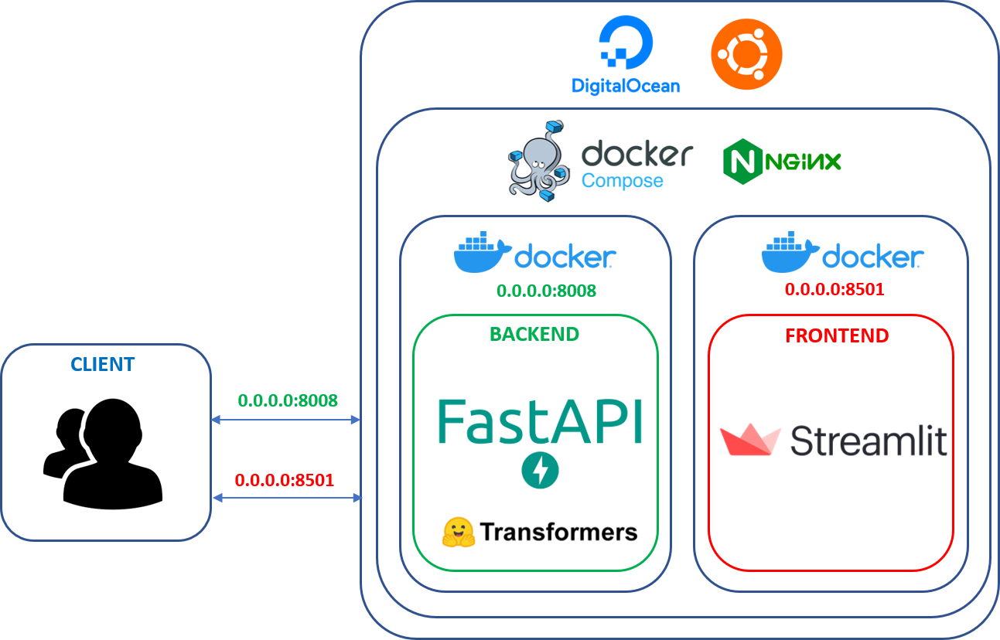

# Machine Learning model serving con FastAPI and streamlit



El objetivo de este _Post_ es dar a conocer la forma de "prototipar" un servicio de machine learning o deep learning desplegado en un servidor de desarrollo, accesible a los desarrolladores para testear los modelos implementados.

El prototipo consta de:
- Una interfaz de usuario (UI) para que dichos usuarios puedan interactuar con el servicio.
- El servio backend con documentación API, de modo que pueda procesar multiples solicitudes y pasarse a producción e integrarse con otras aplicaciones de manera robusta y escalable.


## FastAPI como Backend

[FastAPI](https://fastapi.tiangolo.com/) es un web framework moderno y rápido (de alto rendimiento) para construir APIs con Python 3.6+ basado en las anotaciones de tipos estándar de Python.

Sus características principales son:

- **Rapidez:** Alto rendimiento, a la par con NodeJS y Go (gracias a Starlette y Pydantic). Uno de los frameworks de Python más rápidos.

- **Rápido de programar:** Incrementa la velocidad de desarrollo entre 200% y 300%. *

- **Menos errores:** Reduce los errores humanos (de programador) aproximadamente un 40%. *
- **Intuitivo:** Gran soporte en los editores con auto completado en todas partes. Gasta menos tiempo debugging.
- **Fácil:** Está diseñado para ser fácil de usar y aprender. Gastando menos tiempo leyendo documentación.
- **Corto:** Minimiza la duplicación de código. Múltiples funcionalidades con cada declaración de parámetros. Menos errores.
- **Robusto:** Crea código listo para producción con documentación automática interactiva.
- **Basado en estándares:** Basado y totalmente compatible con los estándares abiertos para APIs: OpenAPI (conocido previamente como Swagger) y JSON Schema.


[FastAPI](https://fastapi.tiangolo.com/) está [ganando popularidad]((https://twitter.com/honnibal/status/1272513991101775872)) entre los Frameworks de Python. Está completamente documentado, permite codificar API siguiendo las estándares de [OpenAPI](https://en.wikipedia.org/wiki/OpenAPI_Specification) y se puede usar `uvicorn`, lo que permite que sea apto para algunos usos de producción. Su sintaxis también es similar a la de Flask, por lo que es fácil cambiar a ella si ha usado Flask antes.


## Streamlit como Frontend


[Streamlit](https://www.streamlit.io/) es una biblioteca de Python de código abierto que facilita la creación y el intercambio de [aplicaciones web personalizadas](https://www.streamlit.io/gallery) para el aprendizaje automático y la ciencia de datos. A día de hoy Streamlit está [ganando terreno](https://twitter.com/streamlit/status/1272892481470857232?s=20), ya que en solo unos minutos puede crear e implementar potentes aplicaciones de datos, pero a día de hoy aún [no puede crear REST endpoints en python.](https://github.com/streamlit/streamlit/issues/439).

[streamlit](https://www.streamlit.io/) is [getting traction](https://twitter.com/streamlit/status/1272892481470857232?s=20) as well. It allows to create pretty complex UIs in pure Python. It can be used to serve ML models without further ado, but (as of today) [you can't build REST endpoints with it](https://github.com/streamlit/streamlit/issues/439).


## Aplicación Fullstack: BERT - Preguntas y Respuestas

En esta demo se utiliza SQuAD (Stanford Question-Answering Dataset). En SQuAD, una entrada consta de una pregunta y un párrafo para el contexto. El objetivo es encontrar el espacio de texto en el párrafo que responde a la pregunta planteada. Evaluamos nuestro rendimiento en estos datos con la métrica "Exact Match", que mide el porcentaje de predicciones que coinciden exactamente con cualquiera de las respuestas de verdad.

Para ello utilizamos el Pipeline proporcionado por del modelo [BETO (Spanish BERT) + Spanish SQuAD2.0](https://huggingface.co/mrm8488/bert-base-spanish-wwm-cased-finetuned-spa-squad2-es) preentrenado en español.


## Implementación del servicio

Como hemos comentado anteriormente, esta aplicacion consta de una aplicación con un frontend streamlit y un backend con FastAPI. Para la implementación de estos servicios se opta por tener dos servicios implementados en dos contenedores Docker, orquestados con `docker-compose`:


```yml
version: '3'

services:

  fastapi:
    build: 
      context: fastapi
      dockerfile: Dockerfile
    ports: 
      - 8008:8008
    environment:
      APP_ENV: "dev"
      APP_DEBUG: "True"
    deploy:
      resources:
        limits:
          cpus: '2'
          memory: 4096M
        reservations:
          cpus: '1.0'
          memory: 2048M
    networks:
      - proyect
    container_name: fastapi-docker

  streamlit:
    build: streamlit/
    depends_on:
      - fastapi
    ports: 
        - 8501:8501
    networks:
      - proyect
    container_name: streamlit-docker

networks:
  proyect:
    driver: bridge

```

Cada servicio corresponde con una imagen Docker, generada a partir de su fichero `Dockerfile`.

Servicio Backend `FastAPI`:
```dockerfile
FROM tiangolo/uvicorn-gunicorn:python3.7

RUN mkdir /fastapi

COPY requirements.txt /fastapi

WORKDIR /fastapi

RUN pip install --no-cache-dir -r requirements.txt -f https://download.pytorch.org/whl/torch_stable.html

COPY . /fastapi

EXPOSE 8008

CMD ["uvicorn", "server:app", "--host", "0.0.0.0", "--port", "8008"]
```
Servicio Frontend `Streamlit`:
```dockerfile
FROM python:3.7-slim

RUN mkdir /streamlit

COPY requirements.txt /streamlit

WORKDIR /streamlit

RUN pip install -r requirements.txt

COPY . /streamlit

EXPOSE 8501

CMD ["streamlit", "run", "ui.py"]
```


El servicio de `streamlit` ofrece una interfaz de usuario que llama (request) al punto final expuesto por el servicio de `fastapi`, mientras que los elementos de la interfaz de usuario (texto, carga de archivos, botones, visualización de resultados) se declaran con llamadas a `streamlit`:

```python
import streamlit as st
from requests_toolbelt.multipart.encoder import MultipartEncoder
import requests
import logging


# FastAPI endpoint
backend = 'http://fastapi:8008/qas/'

def process(context: str, question: str, server_url: str):

    m = MultipartEncoder(
        fields={'context': context, 'question': question}
        )
    r = requests.post(server_url,
                      data=m,
                      params=m.fields,
                      headers={'Content-Type': m.content_type},
                      timeout=8000)
    return r

# UI layout
st.title('Question Answering')
st.write('''Question Answering.
         Visit this URL at `:8008/docs` for FastAPI documentation.''')  # description and instructions

user_input_context = st.text_area("Context:")
user_input_question = st.text_area("Question:")

if st.button('Get Answering'):

    if user_input_context and user_input_question:
        result = process(user_input_context, user_input_question, backend)
        st.write(f'Respuesta:    {result.content}')

    elif user_input_context:
        # handle case with no question
        st.write("Insert question!")

    elif user_input_context:
        # handle case with context
        st.write("Insert context!")

    else:
        # handle case with no question & context
        st.write("Insert context and question!")

```

El backend de `FastAPI` llama a algunos métodos desde un módulo auxiliar `model.py` (que es responsable de la inferencia del modelo usando el Pipeline de la libreria `transformers`) e implementa un endpoint `/qas/` que devuelve la respuesta del modelo:

```python
from typing import Optional
from fastapi import FastAPI, File, Query
from starlette.responses import Response
import io
from model import get_model, get_result
import logging


logging.basicConfig(level=logging.DEBUG)

app = FastAPI(title="Question Answering",
              description=''' El objetivo es encontrar el espacio 
              de texto en el párrafo que responde a la pregunta 
              planteada.''',
              version="0.1.0",
              )
model = get_model()

@app.get("/")
def read_root():
    return {"message": "Welcome from the API"}


@app.post("/qas/")
async def get_qas(context: str = Query(..., min_length=3), question: str = Query(..., min_length=3)):
    '''Get question answering'''
    logging.debug("ejecutar modelo...")

    if context and question:
        result = get_result(model, context, question)
        logging.debug("modelo ejecutado...")
        return result["answer"]
    return {"items": "Null"}
```

El modulo `model.py`quedaria de la siguiente manera:

```python
from PIL import Image
import io
from transformers import pipeline

def get_model():
    qa = pipeline('question-answering', 
              model="mrm8488/bert-base-spanish-wwm-cased-finetuned-spa-squad2-es", 
              tokenizer="mrm8488/bert-base-spanish-wwm-cased-finetuned-spa-squad2-es")

def get_result(qa, context, question, max_size=512):
    r = qa(context=context, question=question)
    return r
```


## Despliegue de la Aplicación
La secuencia de comandos ```start.sh``` es una secuencia de comandos de shell que nos permitirá ejecutar la construcción del ```docker-compose.yml```, para que los contenedores se ejecuten en modo background.
```
#!/bin/bash
docker-compose up -d
```
La primera línea se denomina shebang. Especifica que este es un archivo ```bash``` y se ejecutará como comandos. El indicador ```-d``` se utiliza para iniciar un contenedor en el modo de demonio, o como proceso en segundo plano.
Para probar la creación de las imagen de Docker y los contenedores a partir de las imágenes resultantes, ejecute:
```
sudo bash start.sh
```
Una vez que la secuencia de comandos termine de ejecutarse, utilice el siguiente comando para enumerar todos los contenedores en ejecución:
```
sudo docker ps
```
Verá los contenedores en ejecución en ejecución sobre un mismo servicio. Ahora que se está ejecutando, visite la dirección IP pública de su servidor en el puerto especificado de su navegador http://IP:8501. o accediendo desde su dominio personal http://your-domain:8501.

***
Ahora ya puede visitar la aplicación en http://your-domain:8501 desde un navegador externo al servidor para ver la aplicación en ejecución:


***
También puede acceder a la documentación de FastAPI desde la url http://your-domain:8008/docs


